# Machine Learning & ADHD

_Christiana Smith | Galvanize, Inc. | Oregon Health & Science University | February 2018_

# Project Background
Supervised and unsupervised learning are powerful statistical tools that are surprisingly absent in clinical and psychological research. With this in mind, I collaborated with the **[ADHD Research Lab](ohsu.edu/adhdrs)** at the Oregon Health and Science University to show what data science can do for their lab and research.

# The Data
The data is made up of 901 subjects from the first year of a longitudinal study. There are two target variables:
 * DX
	 * 1 = Control
	 * 3 = ADHD
 * DXSUB
	 * 1 = Control
	 * 3 = Inattentive ADHD
	 * 4 = Hyperactive ADHD
	 * 5 = Combined ADHD

There are two groups of features: temperment scores from the Temperment in Middle Childhood Questionnaire (TMCQ) and data from eight different neuropsych tasks. The TMCQ is given to parents, and the neuropsych tasks are performed by the children in the study.

# Questions
The lab gave me several questions to answer.
1. Which models perform better on the data? How significant are the differences between them?
1. How much can you improve on logistic regression using other machine learning models?
1. What sort of characteristics do we see in temperament and neurocognitive ability?

# Technical Process
I have documented my entire process in the Jupyter Notebooks, 'Supervised Learning' & 'Unsupervised Learning'.

## Prerequisites
The following Python libraries are used:
 * Pandas
 * NumPy
 * scikit-learn
 * SciPy
 * [fancyimpute](https://pypi.python.org/pypi/fancyimpute)
   * Utilizes keras, Tensorflow backend
 * [xgboost](https://github.com/dmlc/xgboost)

## Dataset Preparation
The original csv `Christie_diagnosis_20180118.csv` is housed in a directory `data`, not included on the github repo. It must be split into a training and holdout dataset. This is done by running `holdout_set_prep.py` which splits the original csv into `holdout_data.csv` and `train_data.csv` at a test size of 33%.

# Supervised Learning

To answer the question of which machine learning models best predict ADHD diagnosis, I obtained model metrics on four models (logistic regression, random forest classifier, gradient boosting classifier, and xgboost classifier), on four datasets (DX ~ All, DXSUB ~ All, DX ~ TMCQ, DX ~ Neuro).

Each model used the sklearn defaults. XGboost had a max depth of 3 and a learning rate of 0.1.

## Data Prep
### Missing Value Imputation
Through some analysis, I determined that **Matrix Factorization** was the best strategy for missing value imputation.

### Data Leakage Check
I examined each variable and concluded none were at risk for data leakage.

### Other
The dataset received from the lab had already been extensively cleaned and verified, so no additional data preparation was required.

## Model Metrics
I examined the ROC AUC score and Log Loss of each model, on each dataset.
I ran Mann-Whitney U tests on each combination of model metric within a dataset, to see if there were any statistically significant differences. I used Benjamini-Hochberg FDR control to deal with the problem of multiple testing.

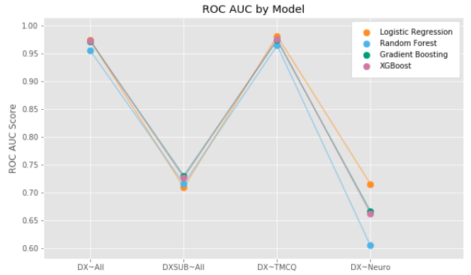
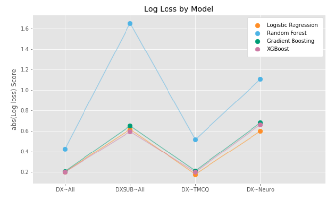

## Conclusions
Overall, the models are on the same page - with exception of Random Forest in the DXSUB ~ All and DX ~ Neuro dataset.

We can conclude that a logistic regression is sufficient to predict ADHD diagnosis from this dataset, and a more "complex" machine learning model is not necessary.

# Unsupervised Learning
To answer the question of what sort of characteristics exist in temperament and neurocognitive ability, I performed cluster analysis on the TMCQ and Neuropsych datasets. I took the full dataset, split into TMCQ and Neuropsych features, split those datasets by ADHD and control, and ran k-means (k=2) on each group.

## Data Prep
### Missing Value Imputation
I used **Matrix Factorization** for missing value imputation, based on the results of my MSE tests I ran in the supervised learning section.

### Splitting Datasets
The full dataset (n=901) was used. See the diagram below to see the process of splitting datasets.

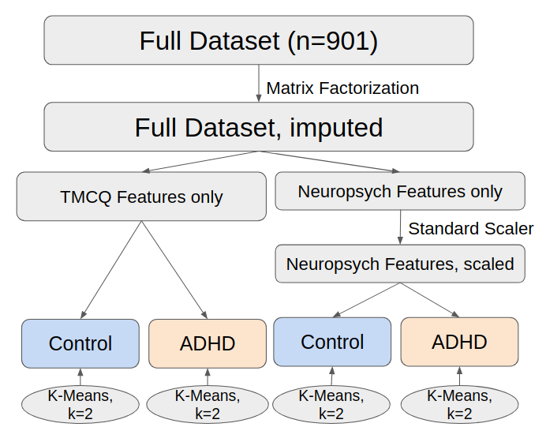

### Choosing k
I picked k based on the results of within-cluster sum of squares and silhouette scores by varying k.

#### TMCQ
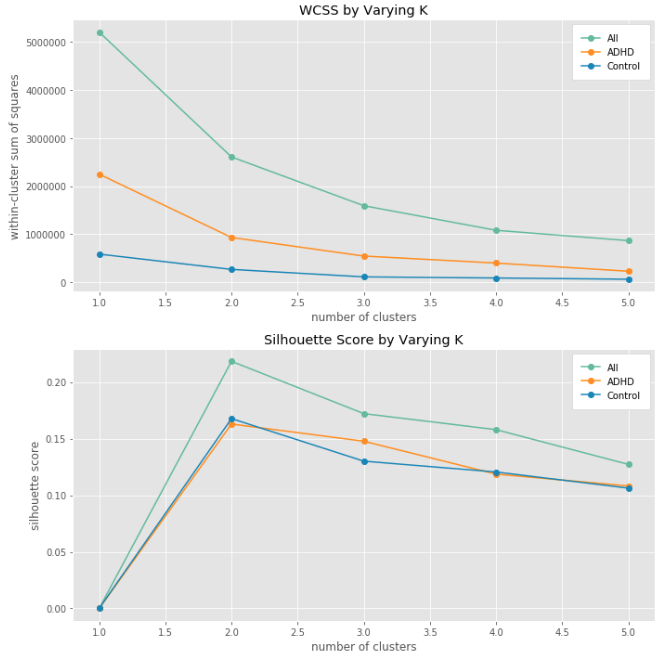

#### Neuro
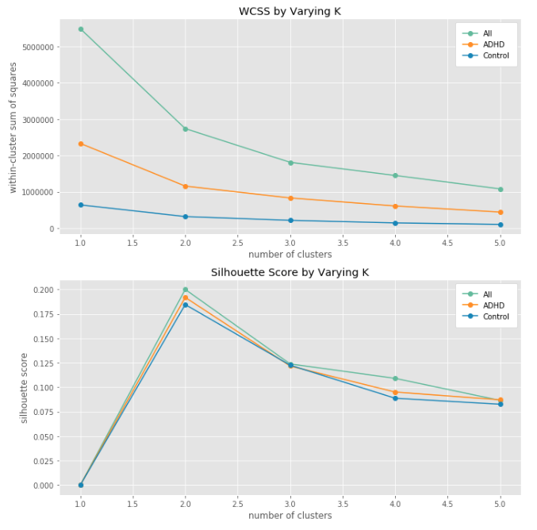

The best silhouette score comes at k=2, across neuro and TMCQ datasets, and across ADHD/Control/All subjects.

## Results

### Cluster Analysis on All Subjects
What kind of insights can we gain from KMeans Cluster analysis on the neuro/TMCQ datasets, with all subjects?

Are we just clustering into ADHD and Control clusters?

Recall, cluster analysis does not have access to diagnosis.

The pie charts below show the proportion of cluster label, within each DX label.  
The radius of the pie chart is: (N of the diagnosis group / Total N) * 2

#### TMCQ
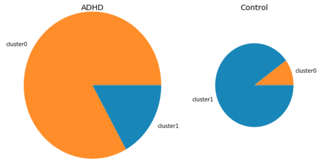

#### Neuro
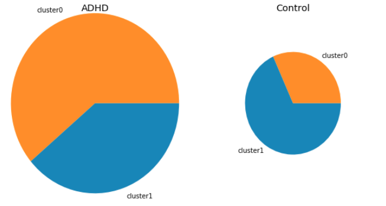

Looks like for the TMCQ, Cluster 0 corresponds to ADHD, and cluster 1 corresponds to Control.

For neuro, the deliniation is not as good, but we do still see more cluster 0 in ADHD, and more cluster 1 in Control.

### Cluster Analysis on ADHD/Control

What kind of patterns might we find in the scores themselves? To answer this, I ran KMeans (k=2) on each cluster, within each DX label. Then I compared the mean feature scores in each cluster between the groups.

#### TMCQ

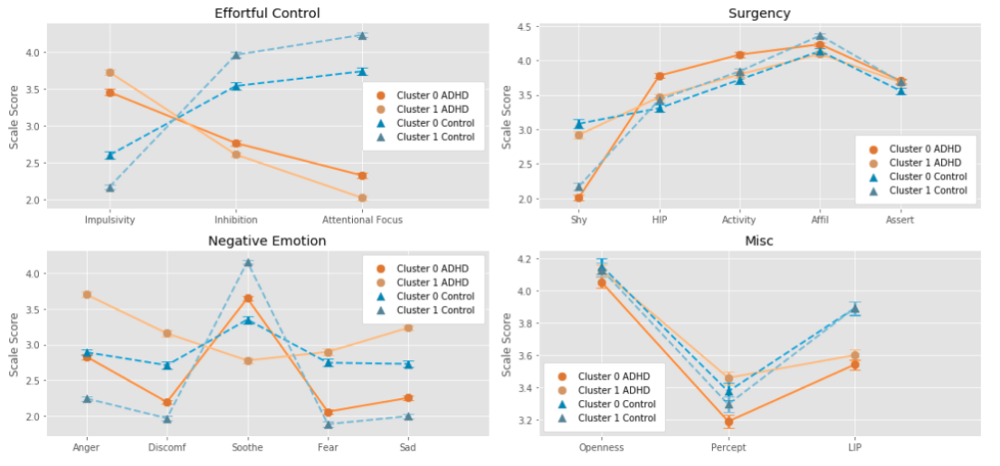

#### Neuro
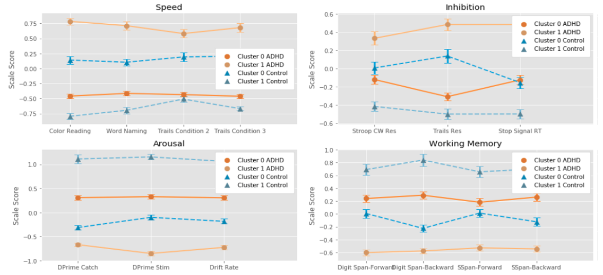

#### Statistical Findings
Out of 186 Mann-Whitney U tests on each combination of cluster within a scale, 160 were statistically significant, suggesting that the cluster analysis successfully found the distinct characteristics in the dataset.

#### Conclusions
Some more specific conclusions are that ADHD clusters have worse effortful control and there is also an ADHD cluster with higher negative emotion, corresponding to the idea of an "irritable" subtype in children with ADHD. For Neuropsych, there seem to be "high" and "low" groups within each domain (speed, inhibition, arousal, working memory), and ADHD always performs worse within these groups.

### Comparing Clusters on Datasets
Is there any connection between the clusters seen in TMCQ scores, and clusters seen in neuropsych data?

To examine this, I looked at confusion matrices for ADHD and Control, and cluster label based on TMCQ/neuro dataset. I also took a look at the statistical significance of the proportions.

#### ADHD
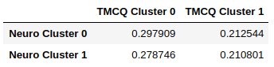

#### Control
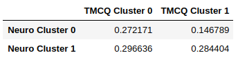

Several cluster combo proportions are significantly different when compared to each other. Next steps may involve further identifying these cluster combinations and naming them.

# Built With
* Python
* Pandas
* scikit-learn
* fancy impute
* XGBoost
* Jupyter
* AWS EC2

# Acknowledgments
Thank you to the ADHD Research Lab for collaborating with me. 
Thank you to the invaluable instructors at Galvanize, Inc., for helping me through this project.
